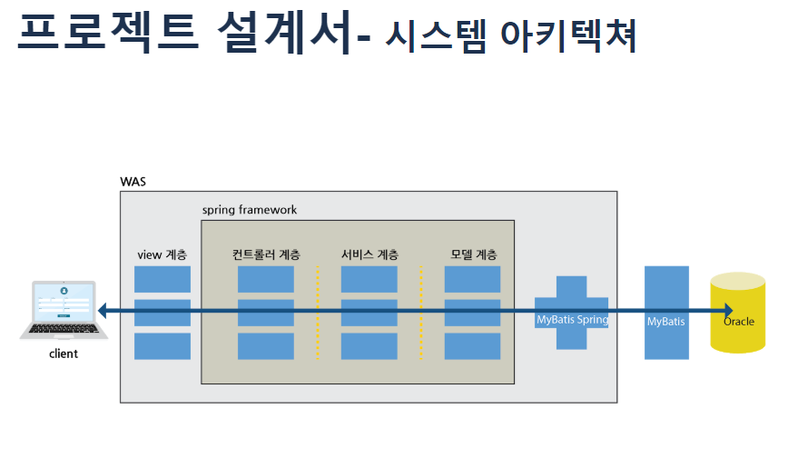
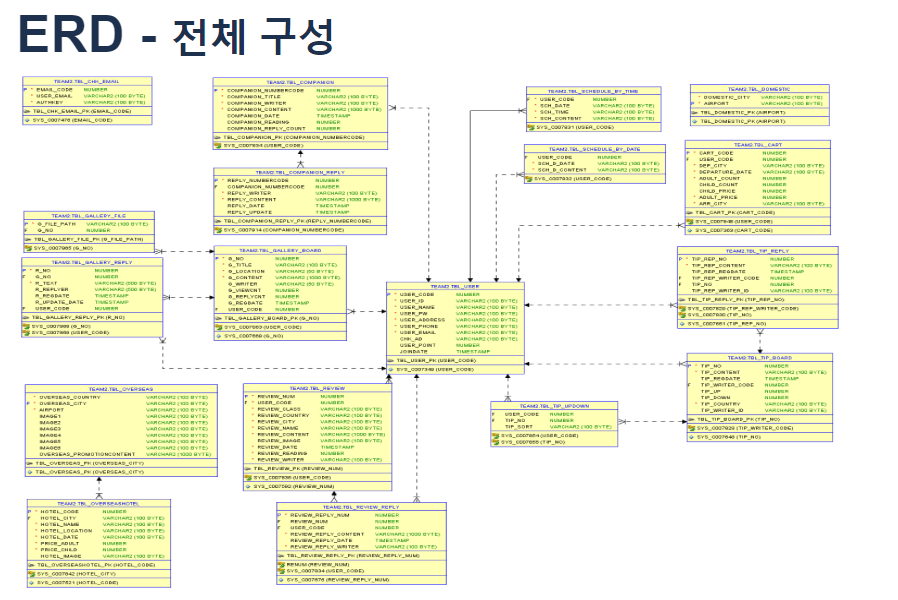
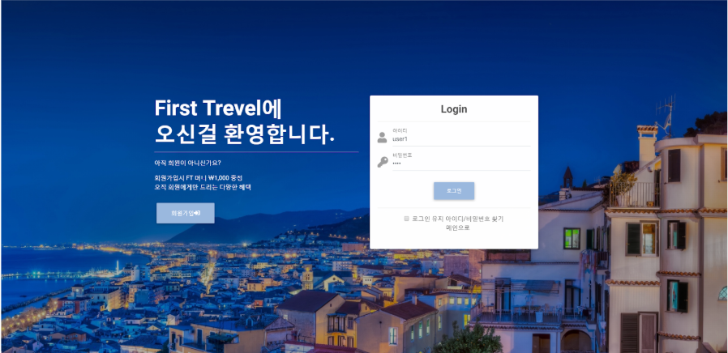
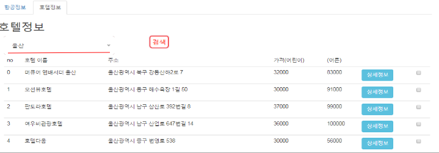
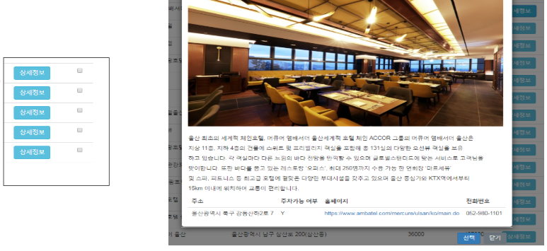
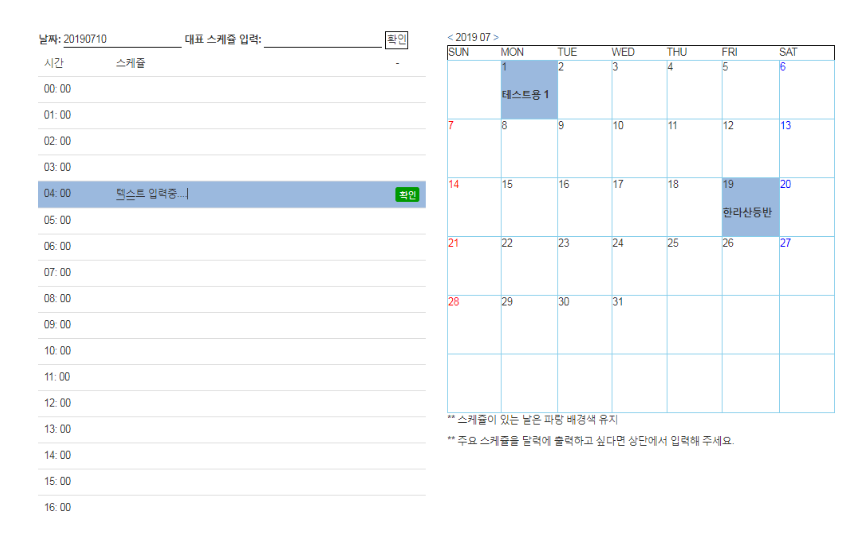

# FirstTravel

여행 계획 관리 도우미

## 주요기능

1. 공공 데이터 포털에서 제공하는 항공, 호텔 정보 Api 로드 / 파싱  
2. 스케쥴 캘린더 기능  
3. 각종 커뮤니티 게시판  

## SKills 
Framework : Spring Framework ( Using My-batis )  
Dependencies : junit,log4j, my-batis, jackson, mail, imgscar ...    
Server Language: JAVA  
Front-end: JQuery, Javascript  
DBMS : OracleDB  

## Preview
### 아키텍쳐  

   
### ERD  

 
### 로그인 페이지  

 
### 항공, 호텔 정보 파싱  

  
  
### 스케쥴러  

 
  
  
 ## Youtube 시연 영상
 [유튜브시연영상](https://youtu.be/9Ng1kC_uNe8)

